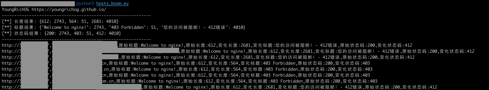

# Hosts_Boom

> 通过hosts碰撞发现目标内部系统，扩大攻击面。

## :bulb:描述
为什么想做这个?

感觉别人的用起来不舒服

## 功能
- [x] 通过标题发现
- [x] 通过长度发现
- [x] 通过状态码发现

## 如何使用

友情提示:请确保IP可访问，否则会有很多timeout影响效率

将整理好的IP和HOST分别放入ips.txt、domains.txt,最终输出程序根目录boom.txt 

```text
python3 hosts_boom.py
```

## 运行截图



## 思考

做出来在告诉你 :-0

## TODO

~~进度条~~

重定向

其他优化


